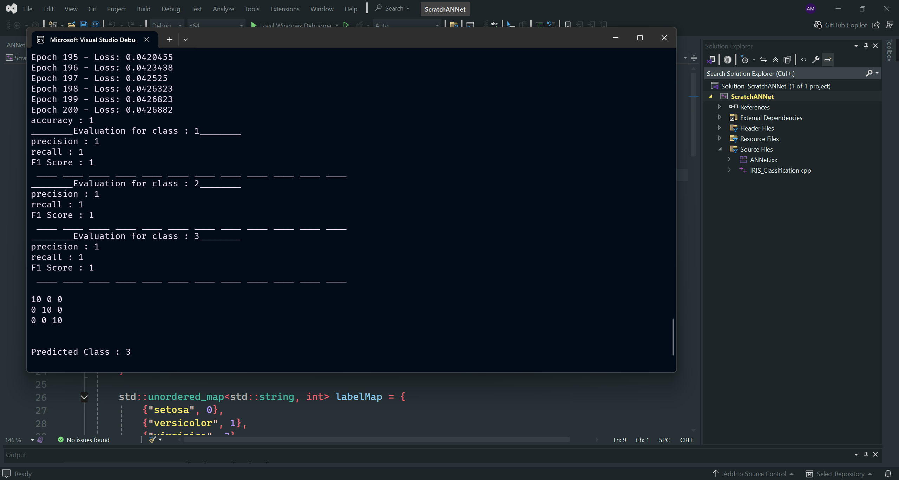

## ScratchANNet

#### `scratchANNet` is a minimalist deep learning framework written entirely from scratch in **C++20** using module files (`.ixx`) — no external ML libraries or frameworks involved.

It includes a fully custom neural network engine with:

- Backpropagation
- Stratified dataset sampling
- ReLU and Softmax activations
- Gradient clipping
- Cross-entropy loss
- L2 regularization
- Performance metrics: Accuracy, Precision, Recall, F1-Score

#

### ◈ Motivation

The goal of `scratchANNet` is to build a fully interpretable and performant neural network engine from first principles using modern **C++20** features (modules, clean OOP, etc.).

#

### ◈ Architecture Diagram


#

### ◈ Features

- C++20 module-based architecture (`export module ANNet;`)
- Fully custom neuron, layer, and network classes
- Dynamic training with gradient clipping and Softmax normalization
- Stratified sampling of datasets
- Real-time evaluation with confusion matrix

#

### ◈ Model Architecture

Example architecture used for the **Iris dataset**:

```text
Input Layer:     4 features
Hidden Layer 1:  4 neurons (ReLU)
Hidden Layer 2:  4 neurons (ReLU)
Output Layer:    3 neurons (Softmax)
```

#

#### Training

- Optimizer: Custom SGD with gradient clipping and L2 regularization
- Epochs: 200
- Learning Rate: 0.005
- Accuracy: **96% on training data**

#

### ◈ Evaluation Metrics

- Accuracy
- Precision (per class)
- Recall (per class)
- F1 Score (per class)

Also prints a full **confusion matrix** for test data.

#

### ◈ Dataset: Iris Flower Classification

- Dataset: `data.csv`
- Format: 4 numerical features + 1 string class label
- Labels: `setosa`, `versicolor`, `virginica`
- Preprocessing: One-hot encoding, stratified train/test split

#

### ◈ Example Usage

```cpp
// Load dataset
auto dataset = readCSVToDataset("data.csv", 4, 3);
auto [trainData, testData] = stratifiedSampling(dataset);

// Initialize and build network
Network model;
model.InputLayer(trainData);
model.HiddenLayer(4);
model.HiddenLayer(4);
model.OutputLayer(3);

// Train
model.train(0.005, 0.001, 0.5, 200);

// Evaluate
model.test(testData);
model.evaluation();
model.showMatrix();

// Predict
vector<double> input = {6.9, 3.2, 5.5, 2.2};
int prediction = model.predict(input);
```

#

### ◈ Sample Output



#

### ◈ Build Instructions

- Requires a **C++20 compatible compiler** (MSVC or Clang with module support)
- Compile with `/std:c++20` and module-aware flags

#

### ◈ Highlights

- No dependencies: only STL
- Uses `std::vector`, `std::random`, and modern C++ idioms
- Debug-friendly and readable
- Fully extensible for other datasets and architectures


#

> *"Building intelligence from scratch helps us understand the soul of computation."*

#

### ◈ License

This project is licensed under the **MIT License**. Feel free to fork, use, extend, or contribute!
